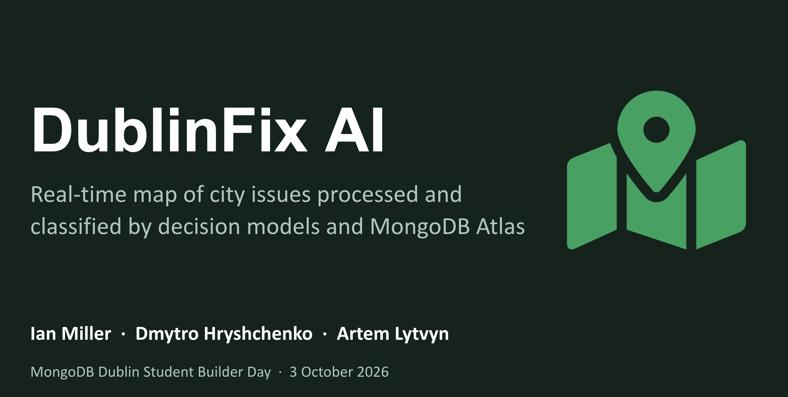
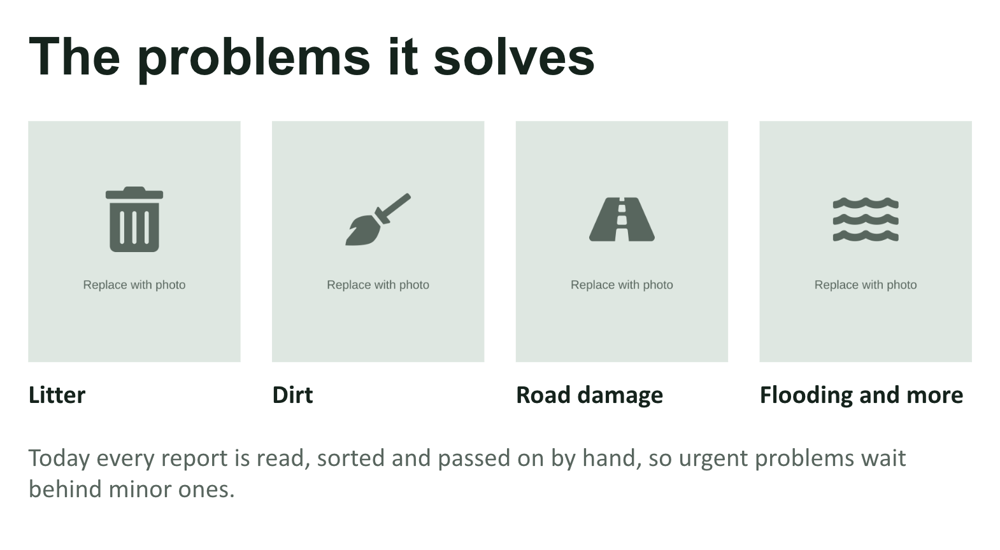
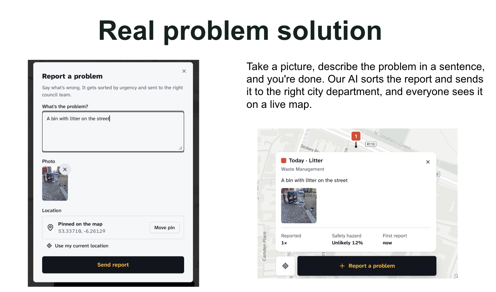
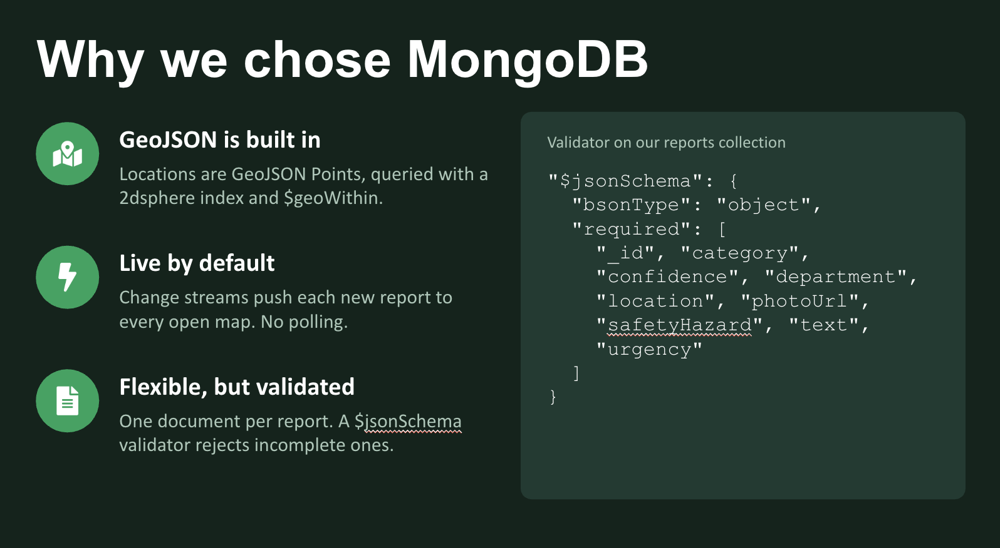
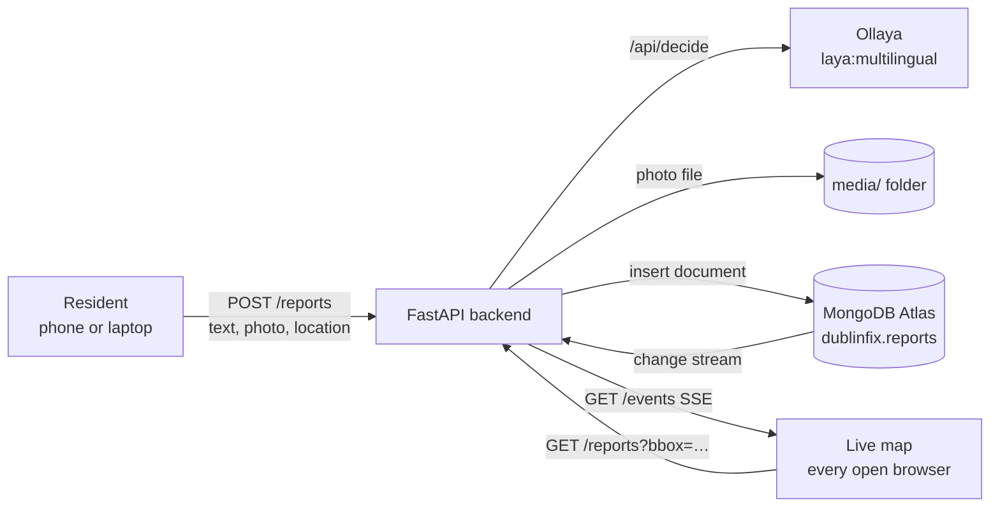

# DublinFix AI



**A live map of city issues, sorted by AI.**

Residents report city problems with a short text, a photo and their location. A local decision model sorts each report in under a second, and MongoDB Atlas stores the reports and powers a live public map where anyone can see what has been reported nearby.

Built for the MongoDB Dublin Student Builder Day, 3 October 2026.

---

## The problem



Reports about potholes, dirty streets, litter, flooding or unsafe areas arrive as free text. Someone has to read each one, decide what it is, judge how urgent it is and pass it to the right team. A dangerous problem can wait in the queue behind minor ones, and residents can't see whether anyone has already reported it.

## How it works



1. **Report.** A resident writes what is wrong and attaches a photo. The location is taken from the device and can be corrected by moving the pin.
2. **Classify.** A local decision model answers fixed questions about the text: what kind of problem it is, how urgent it is, and how likely it is that someone gets hurt. The department follows from the category.
3. **Store.** The text, location and model answers go into one MongoDB document. The photo is saved by the backend, and the document keeps a link to it.
4. **Show live.** Every open map receives the new report straight away through a MongoDB change stream. Each report is a pin coloured by urgency; clicking it shows the text, photo, category and department.

If the model is down, the report is still saved, with the model fields left empty. A submitted report is never lost.

## Why a decision model and not a chatbot

- **Fixed answers.** The output is always one of our options, so there is nothing to parse and nothing invented.
- **Numbers we can use.** Urgency and safety hazard come back as calibrated numbers, so pins can be coloured and sorted directly.
- **Fast, local, free and private.** The model runs on a laptop CPU with [Ollaya](https://ollaya.dev), an open-source runtime for decision models. No API key, no per-request cost, and reports never leave the machine.

## What the model is asked

| Question | Type | Answer |
|---|---|---|
| Category | choice | `road_damage`, `dirt`, `litter`, `water_drainage`, `unsafe_area`, `other` |
| Urgency | score 0–2 | 0 = can wait, 1 = this week, 2 = today. An expected value, so it can fall between levels (e.g. 1.6) |
| Safety hazard | yes/no | Probability (0–1) that people could get hurt |

Each answer also comes with a confidence (0–1), so unsure answers can be flagged for review.

The department is looked up from the category rather than asked of the model, so the two can never contradict each other:

| Category | Department |
|---|---|
| `road_damage`: potholes, broken footpaths, damaged road surface | Roads Maintenance |
| `dirt`: mud, spills, stains, dust or fallen leaves | Street Cleaning |
| `litter`: rubbish, overflowing bins, dumped items | Waste Management |
| `water_drainage`: flooding, blocked drains, water leaks | Drainage and Water |
| `unsafe_area`: anti-social behaviour, harassment, suspected drug dealing | Community Safety |
| `other`: anything else | General Enquiries |

The model is `laya:multilingual`. On our 24 labelled test reports it chose the right category for 22, in about 0.5 s per report on a laptop CPU.

## What MongoDB does



- **Document model.** A report, its location and the model's answers live in one document. Adding a field needs no migration.
- **Geospatial queries.** A `2dsphere` index on `location` lets the map load only the pins inside the visible area.
- **Change streams.** Every new report is pushed to all open maps without a page refresh.
- **Fallback.** If live updates fail, the map polls the same `GET /reports` endpoint every few seconds.

## Architecture



## Tech stack

| Part | Technology |
|---|---|
| Backend | Python 3.12, FastAPI, native async `pymongo`, managed with `uv` |
| Database | MongoDB Atlas (M0), collection `dublinfix.reports` |
| Model | Ollaya on `localhost:11435`, model `laya:multilingual` |
| Frontend | Vue 3, Vite, Pinia, Tailwind 4, shadcn-vue, MapLibre GL |
| Hosting | Frontend on GitHub Pages; backend runs locally |

## Data model

One database, `dublinfix`, with one collection, `reports`. Each report is one document.

```json
{
  "_id": "6ac101f2b1c8c17a86c457ee",
  "text": "Deep pothole on Dame Street, cars swerving",
  "photoUrl": "/media/34f62c46a711457f90641a9198b184ff.png",
  "location": { "type": "Point", "coordinates": [-6.2654, 53.3441] },
  "category": "road_damage",
  "department": "Roads Maintenance",
  "urgency": 1.807,
  "safetyHazard": 0.6596,
  "confidence": { "category": 0.9463, "urgency": 0.7269 }
}
```

| Field | Filled by | Notes |
|---|---|---|
| `_id` | MongoDB | Also carries the insert time, so there is no `createdAt` field |
| `text` | Resident | 3–2000 characters |
| `photoUrl` | Backend | `/media/<random name>`; the photo file itself is not stored in MongoDB |
| `location` | Device | GeoJSON Point, coordinates `[longitude, latitude]` in that order |
| `category`, `department`, `urgency`, `safetyHazard`, `confidence` | Model | `null` if the model was unavailable. Clients can never set these |

Indexes: `location` (`2dsphere`).

## API

The backend runs on `http://localhost:8000`. Interactive docs are at `/docs`.

| Method | Path | What it does |
|---|---|---|
| `POST` | `/reports` | Submit a report as a form upload: `text`, `photo` (jpeg/png/webp, max 5 MB), `lng`, `lat`. Returns `201` and the stored report |
| `GET` | `/reports?bbox=minLng,minLat,maxLng,maxLat&limit=500` | Reports inside the map area, newest first. Without `bbox`, returns all (up to `limit`) |
| `GET` | `/reports/{id}` | One report; `404` if it doesn't exist |
| `GET` | `/events` | Live feed (Server-Sent Events): one `data: <report JSON>` message per new report, plus a ping every 15 s |
| `GET` | `/media/{file}` | A report photo |
| `POST` | `/classify` | Classify a text without saving it: `{"text": "…"}`. For previews and debugging |
| `GET` | `/health` | Whether Ollaya is reachable and the model is installed |

Errors: `422` for invalid input, `413` for a photo over the size limit, `503` if the database is unreachable.

## Getting started

### Prerequisites

- [uv](https://docs.astral.sh/uv/) (Python 3.12+)
- [Ollaya](https://ollaya.dev): `curl -fsSL https://ollaya.dev/install.sh | sh`, then `ollaya pull laya:multilingual`
- A MongoDB Atlas cluster and its connection string. The free M0 tier supports change streams
- Node.js 22 for the frontend

### Backend

```bash
cd backend
cp .env.example .env        # then set MONGODB_URI
uv sync
uv run uvicorn app.main:app --reload --port 8000
```

`MONGODB_URI` is required; the app won't start without it.

| Setting | Default | Meaning |
|---|---|---|
| `MONGODB_URI` | (required) | Atlas connection string |
| `MONGODB_DB` | `dublinfix` | Database name |
| `OLLAYA_URL` | `http://localhost:11435` | Ollaya daemon |
| `OLLAYA_MODEL` | `laya:multilingual` | Decision model |
| `OLLAYA_TIMEOUT` | `30` | Seconds before a model call gives up |
| `MEDIA_DIR` | `media` | Where photos are saved |
| `MAX_PHOTO_BYTES` | `5000000` | Largest accepted photo |

### Try it

```bash
# Watch the live feed in one terminal
curl -N localhost:8000/events

# Submit a report in another
curl -F text="Deep pothole on Dame Street, cars swerving" -F photo=@pothole.jpg \
     -F lng=-6.2654 -F lat=53.3441 localhost:8000/reports

# Reports in central Dublin
curl "localhost:8000/reports?bbox=-6.4,53.2,-6.0,53.5"

# Classify without saving, or from the command line with no server
curl -X POST localhost:8000/classify -H 'content-type: application/json' \
     -d '{"text": "Overflowing bins on Thomas Street"}'
uv run python -m app.classifier "Street light is out at the corner"
```

The new report appears in the first terminal within about a second.

### Frontend

```bash
cd frontend
npm ci
npm run dev
```

Set `VITE_API_URL` to the backend URL to use real data. Without it, the frontend runs in demo mode with synthetic reports. Pushing to `main` deploys the frontend to GitHub Pages.

### Tests

```bash
cd backend
uv run pytest
```

Tests run against the `dublinfix_test` database on Atlas, never `dublinfix`, and clean up after themselves. The model is replaced with a stand-in, so Ollaya doesn't need to be running.

## Project structure

```
backend/
  app/
    main.py           app, CORS, startup (media folder, indexes, model warm-up), /health, /classify
    config.py         settings loaded from backend/.env
    db.py             MongoDB client, reports collection, indexes
    reports.py        Report model and to_report(): the one shape every endpoint returns
    classifier.py     questions for the model and classify(); swap the model here
    routes_write.py   POST /reports
    routes_read.py    GET /reports, GET /reports/{id}
    events.py         change stream → GET /events live feed
  tests/              pytest suite (test_write.py, test_read.py)
frontend/
  src/app/            Vue app: map, report dialog, report cards, Pinia store
  src/lib/api.js      backend client, with demo mode when VITE_API_URL is unset
```

## Status

Working end to end in the backend: submitting a report with a photo, classification, durable storage when the model is down, map-area queries, and the live feed.

Still to do:

- **Connect the frontend to the backend.** `frontend/src/lib/api.js` was written before the backend existed and uses a different contract:

  | Frontend expects | Backend provides |
  |---|---|
  | `/api/reports` | `/reports` |
  | form fields `description`, `media` | `text`, `photo` |
  | `/api/reports/stream`, event name `report` | `/events`, unnamed `data:` messages |
  | `id`, `report_count` on each report | `_id`, no count |

- Docker setup for the backend.

If time allows: merging duplicate reports made close together, a review queue for answers the model is unsure about, Vector Search to match reports with different wording, and a statistics page.

## Security notes

- Never commit `.env`. Only `.env.example` belongs in git.
- The Atlas network access list is open (`0.0.0.0/0`) for the hackathon. Tighten it and rotate the database password afterwards.
